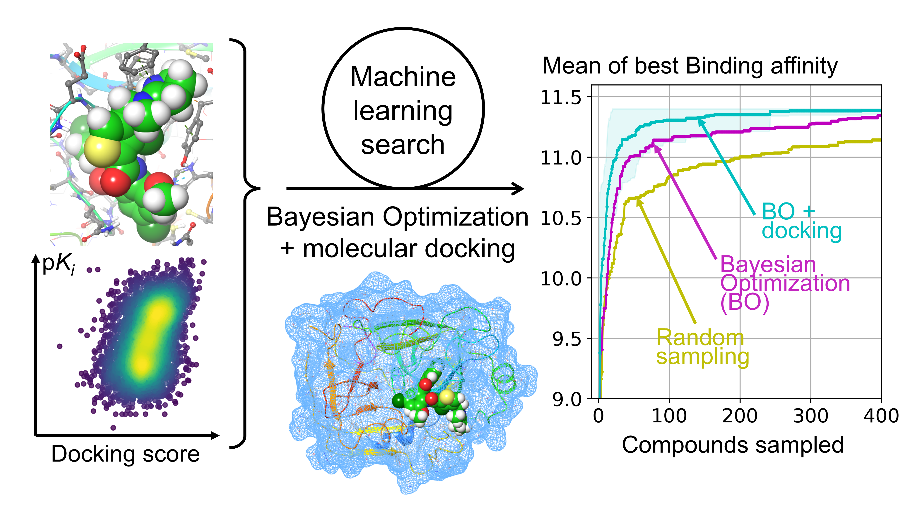

# finding_ligands

*Workflow combining docking and active learning / Bayesian optimization for searching small-to-medium ligand libraries*



### Setup


##### 1. Create the python environments used in this work

In `envs/`, you can find YAML files for two environments.

py3env is the main python3 environment used.

DXGB is used for delta_LinF9_XGB docking re-scoring.

```python
conda env create --name py3env --file=py3env.yml
conda env create --name DXGB --file=DXGB.yml
```


##### 2. Set up delta_LinF9_XGB 

The folder `delta_LinF9_XGB/` contains a copy of the repository https://github.com/cyangNYU/delta_LinF9_XGB.git

The software has been slightly modified:

a. There is a new script `runXGB_all.py` in `delta_LinF9_XGB/script/` that returns intermediate vina features as well as the final docking score

b. The scripts have been modified with relative paths in place of absolute paths using the Python package `os`

c. MGLTools has been modified to work with Python3 instead of Python2 using `2to3`, `autopep8` and manual corrections

d. This MGLTools version is contained in the file `mgltools_x86_64Linux2_1.5.6.tar.gz` in the root directory of this repository

Unzip the tar files for MGLTools, AlphaSpace and MSMS using the following commands:

```
tar -xvzf mgltools_x86_64Linux2_1.5.6.tar.gz
cd mgltools_x86_64Linux2_1.5.6
tar -xvzf MGLToolsPckgs.tar.gz
export PYTHONPATH=$(pwd)/MGLToolsPckgs/:$PYTHONPATH
cd ..
cd delta_LinF9_XGB/software/
tar -xvzf AlphaSpace2_2021.tar.gz
mkdir msms
tar -xvzf msms_i86_64Linux2_2.6.1.tar.gz -C msms
cd msms
cp msms.x86_64Linux2.2.6.1 msms
```  
If you encounter ModuleNotFoundError: No module named 'MolKit' when running `gen_delta.py`, run `export PYTHONPATH={AbsPathTo}/mgltools_x86_64Linux2_1.5.6/MGLToolsPckgs/:$PYTHONPATH` in a bash shell (where `AbsPathTo` is defined by the user; may add this to a .bashrc file to automatically add to PYTHONPATH on shell startup).  

Install AlphaSpace manually to the DXGB environment using the following commands:

```
conda activate DXGB
cd delta_LinF9_XGB/software/AlphaSpace2_2021
pip install -e ./
```

If there are any additional problems in setting up delta_LinF9_XGB, follow the setup tutorial in `delta_LinF9_XGB/README.md`, but ensure you are still using the modified scripts supplied here


##### 3. Set up dockstring

The folder dockstring/ contains a copy of the repository https://github.com/dockstring/dockstring.git

The software has been slightly modified:

a. The `--log` option for vina has been commented out in the `_dock_pdbq` function of the `target.py` script

b. A function that attempts to correct OpenBabel protonation errors has been added to the `protonate_mol` function of the `utils.py` script

c. The latest AutoDock Vina release (`vina_1.2.6_linux_x86_64`) was downloaded from https://github.com/ccsb-scripps/AutoDock-Vina/releases and placed in `dockstring/resources/bin/vina_linux_new` and this is pointed to by the `get_vina_filename` function of the `utils.py` script

This package should not require any further installation steps (there is no need to `pip`/`conda` install dockstring)


### Create datasets

Modify scripts where necessary by specifying the protein target using its gene name (e.g. EGFR, ACHE, PTGS2) as found in DUD-E or dockstring
e.g.
```python
target = "EGFR"
```

1. (py3env) Use `gen_chembl.py` to download $K_i$ activity data from ChEMBL via the chembl-webresource-api and generate molecular features using RDKit

2. Move the `{target}_data_pKi.csv` file to the `{target}/ folder`

3. Move the desired PDBQT file from `dockstring/resources/targets` to the `{target}/` folder and convert to PDB using 

```
cut -c-66 ${target}.pdbqt > ${target}.pdb
```

4. (py3env) Use the `gen_dockstring.py` script to dock the ligands contained in `{target}_data_pKi.csv` to the target PDB file

5. (DXGB) Use the `gen_delta.py` script to re-score the docked ligand poses contained in `{target}/conformers`  

6. (py3env) Use `cluster.py` to cluster the ligand library using k-means clustering on PCA-reduced molecular fingerprints


### Run supervised / active learning

Modify scripts where necessary by specifying the protein target using its gene name (e.g. EGFR, ACHE, PTGS2) as found in DUD-E or dockstring
e.g.
```python
target = "EGFR"
```

1. (py3env) Optionally, view the data file `{target}_data_3d_delta_pKi.csv` using `view_data.py`, `plot_2d.py` and `plot_3d.py` scripts

2. (py3env) Use the `supervised_learning.py` script to perform supervised_learning on the `{target}_data_3d_delta_pKi.csv` data

3. (py3env) Use the `active_learning.py` script to perform active learning optimization on the `{target}_data_3d_delta_pKi.csv` data to find the ligand with the highest $pK_i$

4. (py3env) Analyze the results of active learning with the scripts `plot_results.py` and `post_analysis.py`

### References

1. Chao Yang and Yingkai Zhang. *J. Chem. Inf. Model.*, **62**, 2696 - 2712., (2022).

   [Delta Machine Learning to Improve Scoring-Ranking-Screening Performances of Protein–Ligand Scoring Functions.](http://dx.doi.org/10.1021/acs.jcim.2c00485)

2. García-Ortegón, Miguel, et al. *J. Chem. Inf. Model.*, **62**, 3486 - 3502., (2022).

   [DOCKSTRING: easy molecular docking yields better benchmarks for ligand design.](http://dx.doi.org/10.1021/acs.jcim.1c01334)

3. Lacour, Antoine, et al. *ChemRxiv*, (2024).

   [DockM8: An All-in-One Open-Source Platform for Consensus Virtual Screening in Drug Design.](https://chemrxiv.org/engage/chemrxiv/article-details/669e53ee01103d79c5324046)

5. Lewis-Atwell, Toby, et al. *ACS Catalysis*, **13**, 13506 - 13515., (2023). 

   [Reformulating Reactivity Design for Data-Efficient Machine Learning.](http://dx.doi.org/10.1021/acscatal.3c02513)

